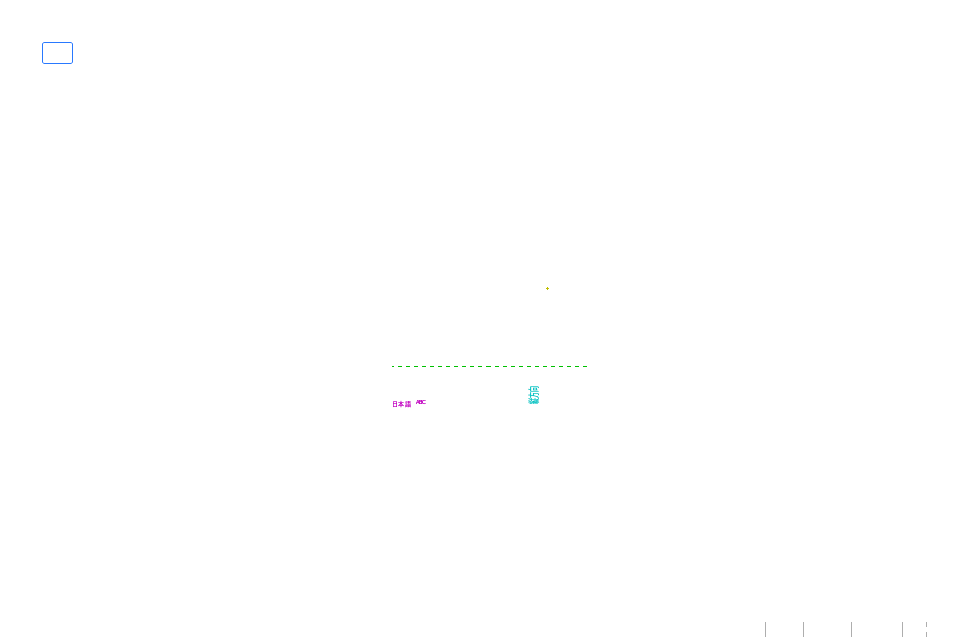
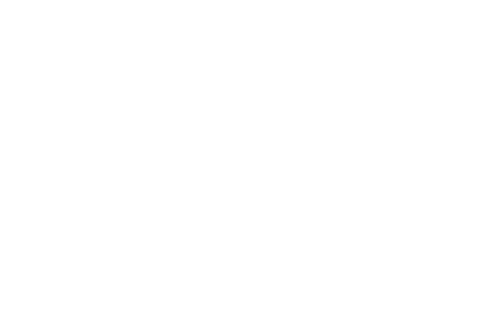
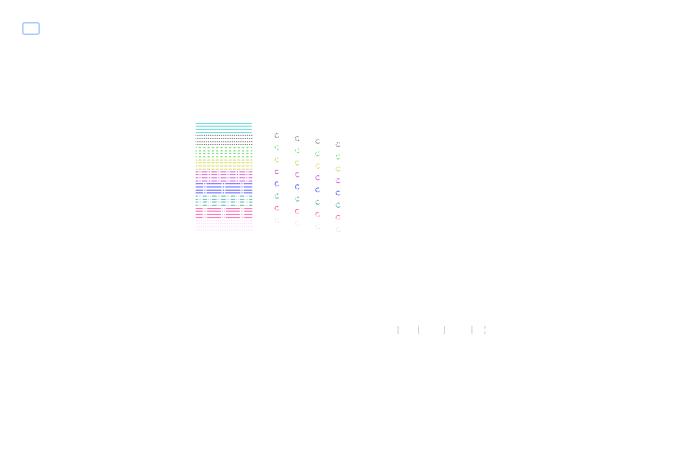
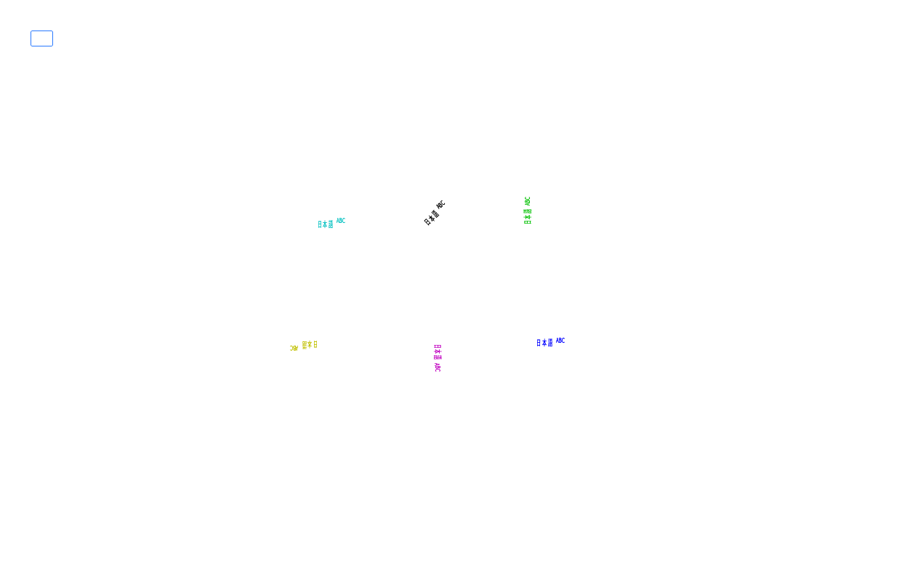
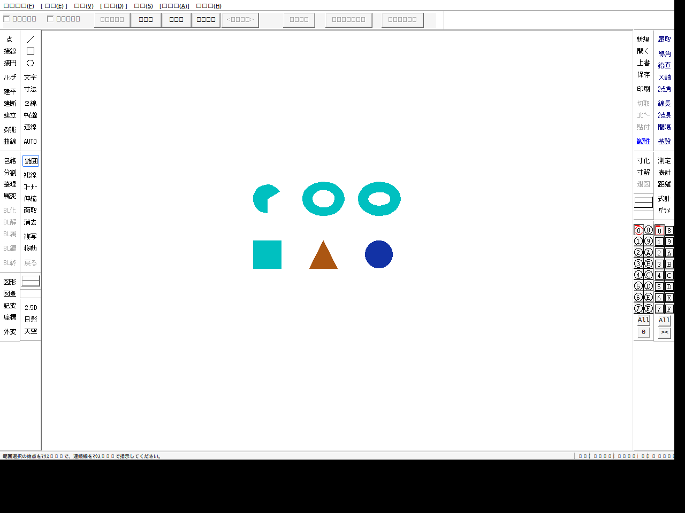

# JWW writer: native application evidence

The version-700 writer passed open → save → reopen → save in **Jw_cad
10.02.1 on Wine 9.0 for 21 cases** on 2026-10-03. Eleven cases also passed
independent checks of Jw_cad's DXF output. This qualifies the recorded geometry
and exposed attributes under that environment. Native saving changes text layout
and can lose memo content; display qualification is partial. **Windows desktop
validation has not been run.** A Windows CI reader test does not change that status.

The 21-case qualification above predates the extension work described below.
See [JWW writing](JWW_WRITE.md) for the supported input contract.

## Matrix

Every row was opened and saved twice, with both CAD processes exiting normally.
The original writer inputs remained byte-for-byte unchanged.

| Cases | Coverage | Native JWW result | Native DXF |
| --- | --- | --- | --- |
| `empty`, `line`, `circle`, `arc`, `point`, `text` | Empty file; individual primitives; arc crossing zero; Japanese text | Geometry and attributes retained; native text endpoint recalculated | Verified |
| `basic` | Six mixed entities, text spacing and 90° text | Retained, with text layout changes | Verified |
| `settings` | A4; all 16 groups/layers; names, current selection, state, protection; scale 0.5 and 50 | All exposed settings and entity coordinates retained | Verified with measured paper/scale transform |
| `attributes` | 72 lines/arcs; pen styles/colors 1–9; widths 0, 1, 25, 500; layers 1–9 | All geometry and base fields retained | Layer, line type, color and geometry verified |
| `text_styles`, `text_rotations` | Two fonts, size 2.5 × 4, spacing 0.5; angles 0°, 45°, 90°, 180°, 270°, 359° | Content, font, size, spacing and angle retained; endpoints recalculated | Verified; baseline rule below |
| `unicode` | Supplementary characters, empty text, 255/1,024-character text, long layer names | Nonempty text and layer names retained; empty TEXT removed | Not run; earlier long-text export failed |
| `count65534`, `count65535`, `count65536` | Unique lines around the MFC extended-count boundary | Exact counts, coordinates and attributes retained | Not run |
| `late_classes` | 32,766 lines followed by circles/arcs, points and text; late class declarations/references | 32,772 entities retained, with text endpoint changes | Not run |
| `cstring_boundaries` | Group/layer names of 254, 255, 256, 65,533, 65,534, 65,535, 65,536 UTF-16 units; supplementary endings | Names retained; long memo shortened | Not run |
| `memo_ascii64`, `memo_ascii65`, `memo_utf16_64`, `memo_utf16_65` | Memo content around observed native retention boundaries | Measured changes below | Not run |

The comparison checks entity order/count, geometry, every entity base field,
paper size, current group, every layer/group setting and the palette. It permits
equivalent arc angles modulo 360°, the measured text endpoints, deletion of empty
TEXT and six recognized internal setting TEXT records. Other ordinary entities
cannot be discarded by the comparison. Native line-pattern tables change on save
and are outside the exposed writer options; this is not whole-header equality.
DXF tags are read directly, independently of ezjww's DXF converter.

## Native changes and limits

### Memo retention

The following are exact observations of this application/template combination,
not a general string-size limit. `CRLF` denotes a line break inserted by Jw_cad.

| Input memo | Memo after each native save |
| --- | --- |
| Empty | `CRLF` |
| 64 ASCII `m` characters | 32 `m` + `CRLF` + 32 `m` |
| 65 ASCII `m` characters | Same 64 characters plus `CRLF`; final character lost |
| 62 `長` + `𠮷` (64 UTF-16 units) | 31 `長` + `CRLF` + 31 `長`; supplementary character lost |
| 63 `長` + `𠮷` (65 UTF-16 units) | Same 62 characters plus `CRLF`; tail lost |
| 65,532 `長` + `𠮷` | Same 62 characters plus `CRLF`; tail lost |
| `日本語𠮷` + `CRLF` | Preserved |

The writer itself preserves these strings. It does not truncate input to match
the application. Avoid relying on long memo retention after a native save; the
large layer/group names were retained in the tested files, but their usability
in the application's editing dialogs was not qualified.

### Text layout and DXF rotation

Jw_cad recalculates text endpoints when saving. The checks pin the observed
endpoints and verify content, font, size, spacing, insertion point and angle
separately. There is no claim of identical font metrics across machines.

In this run, the native DXF exporter used the **baseline direction** from the
supplied start/end points. The screen used the separate JWW text `angle` field.
`text_styles` deliberately gives every text a horizontal baseline while varying
`angle`; its DXF rotations are all 0°. `text_rotations` aligns the baseline with
`angle`, and all six rotations survive DXF export, including equivalent negative
angles for 270° and 359°. Keep both values aligned when native DXF export matters.
This result does not change ezjww's own DXF conversion behavior.

Native DXF export of the earlier 1,024-character text case exited before finishing
its file. The current `unicode` run therefore uses `--jww-only`. Large-count and
long-name DXF exports are also unqualified.

## Display evidence

The captured Wine desktop used Xvfb at 1280 × 900, a fresh Wine prefix, code page
932 and Windows Python 3.11.9. Font substitution and incomplete client repainting
were visible. In particular, solid circles/arcs were missing with Direct2D enabled.
They appeared after disabling Direct2D in copies of `circle` and `basic` native
outputs. A byte comparison proves that only `View_Direct2d = 1` changed to `0`;
the drawing geometry was untouched. These diagnostic copies are not writer outputs
or a new supported writer setting.

| Direct2D enabled: circle/arc absent | GDI diagnostic copy: circle/arc visible |
| --- | --- |
|  |  |





These are manual visual observations, not pixel-equivalence tests. Black client
areas and different viewport sizes are retained in the evidence. Windows font
fidelity, Direct2D rendering, physical line widths, printing and every layer's
visibility in the UI still need a Windows desktop check before a broader claim.

## Evidence and provenance

[`jww_samples/writer/compatibility`](../jww_samples/writer/compatibility) contains:

- `manifest.json`: exact case inventory, measured expectations, source revision,
  application hashes and compressed/uncompressed artifact SHA-256 values.
- `validation.json`: reproducible semantic results, including memo loss and
  native header changes. A successful check includes those documented changes.
- Original inputs, both native JWW saves, eleven DXFs and client BMP captures,
  stored as deterministic gzip streams. No application binaries or fonts.
- Two unmodified native run logs and the exact scripts used. Run 1 did not record
  its own script hash; its preserved script is hashed by the archive. Its prefix
  glob also listed `text_styles` artifacts in the `text` event. Those extra
  references remain in the log and are checked against the same archived files.
  Run 2 fixes that inventory issue and records its script hash.
- A separate display probe log/script and the two derived GDI drawings/captures.
  Its shared automation helper is the archived run-2 script.

The core writer is from merged revision
`1354851b4fa27c9204449281125d39c831153e03`; the expanded case generator is included
in this change. Jw_cad's executable SHA-256 is
`95e6b11c4ee014e0079f288429ae2c6e5eed41141a963e4b8770d2e8ead87acf`;
`DXF_HDR.DAT` is
`78d8cfb8c1f630078205a0d612b98c82075e350801412d8fc282820253ffc430`.
Run timestamps, Windows-reported version and Python version are in the logs.
The drawings and tools are original repository work under MIT; screenshots also
contain Jw_cad's interface. The PNGs above are conversions of the archived BMPs.

## Reproduce

### Offline regression checks

Build/install the current extension first. The output directory must be new:

```sh
cargo run -p ezjww-core --example jww_compatibility --locked -- /tmp/writer-inputs
python scripts/jww/check_fixtures.py
python scripts/jww/check_compatibility.py --generated /tmp/writer-inputs
python -m pytest -q tests/python/test_jww_compatibility.py
```

CI regenerates and compares all 21 inputs byte for byte on Linux, macOS and
Windows. The Python checker validates both native saves and eleven native DXFs.
TypeScript tests exercise the raw and wrapped WASM writer/reader on the expanded
corpus, restoring this matrix's known blank-name defaults before serialization.
The five earlier independently constructed cross-language writer cases remain.
Offline checks never launch Jw_cad.

### New native run

Use a disposable Windows desktop or isolated Wine prefix/display. Provide the
pinned Jw_cad executable, required DLLs and `DXF_HDR.DAT` in a fresh runtime
directory, then copy the generated inputs into it. With a normal Windows Python
installation, run (one line per command):

```text
python scripts\jww\native_roundtrip.py --runtime C:\lab --log C:\lab\native.json --cases empty line circle arc point text basic settings unicode attributes text_styles text_rotations count65534 count65535 count65536 late_classes cstring_boundaries memo_ascii64 memo_ascii65 memo_utf16_64 memo_utf16_65 --jww-only unicode count65534 count65535 count65536 late_classes cstring_boundaries memo_ascii64 memo_ascii65 memo_utf16_64 memo_utf16_65 --screenshots basic attributes text_styles text_rotations late_classes
python scripts\jww\native_display_probe.py --runtime C:\lab --log C:\lab\display.json
```

Save the exact runner scripts alongside each log. An embedded Windows Python
distribution may require adding `scripts/jww` to its module search path.
The tools refuse existing output files, control only their own CAD processes,
restore folder preferences and retain partial logs if an operation fails.

Archive a completed Wine run into a **new** directory with:

```sh
python scripts/jww/archive_compatibility.py \
  --run native.json runtime captured-native_roundtrip.py \
  --display-run display.json runtime captured-native_display_probe.py \
  --writer-revision FULL_WRITER_COMMIT --output new-evidence
```

Repeat `--run` if the matrix was split into several runs. The current archive
checker deliberately requires Wine 9.0 evidence; preserve a new Windows run
separately and add its environment/expectations before claiming Windows support.
Never regenerate measured expectations merely to hide a regression.

## Writer extensions: 2026-10-04

Seven additional generated cases passed native open/save/reopen/save and DXF
export on **Jw_cad 10.02.1 / Wine 9.0**, using Linux Python, xdotool and a fresh
prefix/display. All original input hashes remained unchanged; every CAD process
exited normally. The [archived inputs, outputs, screenshots, exact runner and
hash manifest](../jww_samples/writer/extensions) contain no application binaries
or fonts. [Semantic results](../jww_samples/writer/extensions/validation.json)
are reproduced by `python scripts/jww/check_extensions.py` and Python CI.

| Case | Native JWW result | Native DXF result / limit |
| --- | --- | --- |
| `sxf_colors` | Pens 1/9/101/116/117/256/356 and three allocated colors retained; full palette retained | Reserved pen 100 changes to 1. DXF maps colors to ACI; it emits no true-color group 420 |
| `sxf_linetypes` | 16–19 and 31–62 retained, including custom 6/2-mm pattern; active tables retained | Reserved style 30 changes to 9; reserved table slot 30 is rewritten |
| `solid` | Quad, triangle, inline RGB, disk, sector and styles 105/106 retained; fills visible | Polygon SOLIDs retained; curved fills/rings are partially reduced to outlines/line segments |
| `ellipse` | Three full/partial/tilted ellipse records retained exactly | Jw_cad exports 102 LINEs, not ELLIPSE. ezjww's own DXF converter emits ELLIPSE |
| `dimension` | Three CDataSunpou records and all inline attributes/auxiliaries retained | Export becomes LINE/TEXT/POINT. Interactive dimension recalculation was **not tested** |
| `block` | Two nested definitions, scales 0.01 and rotations retained; native name suffix added | Two top-level INSERTs and nested block definitions retained |
| `text_auto_end` | Content, sizes, presets, spacing and angles retained; endpoints recalculated | Four endpoint errors were 0.75, 1.25, 1.25 and 1.75 mm, each within size_x |



These results do not satisfy an interpretation of R1/R4 requiring Jw_cad's own
DXF exporter to preserve arbitrary RGB or emit native ELLIPSE entities. They
establish preservation in JWW and record the native DXF exporter's limitations.
New entities' Windows desktop, dimension editing and printing remain unqualified.
The original 21-case evidence and the new seven-case evidence are separate runs.

The request also reports **partial painting under Wine**: only a prefix of the
entity list appeared, and reversing the entity order made the previously absent
part visible. This is a downstream observation, not a new reproduction in this
seven-case run. Do not treat a Wine screenshot alone as proof of missing records.
Compare parsed entities and native saves, and inspect a derived GDI copy. The
existing Direct2D/GDI comparison above and new screenshots retain environment
limits and font substitution; they do not establish pixel or print fidelity.

The Linux procedure is in [the extension guide](WRITER_EXTENSIONS.md#linuxwine-native-harness).
To archive a new completed run without copying its application/prefix:

```sh
python scripts/jww/check_extensions.py --archive-run /tmp/extension-native \
  --directory /tmp/extension-evidence --report /tmp/extension-validation.json
```

The checker regenerates all seven inputs byte for byte, checks artifact hashes
and both native JWW saves, and reads DXF tags independently of ezjww's converter.
Native normalizations are explicit assertions, including reserved slots and
block-name metadata; unrelated differences fail the check.
